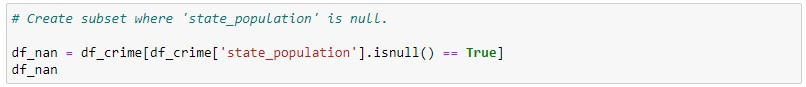
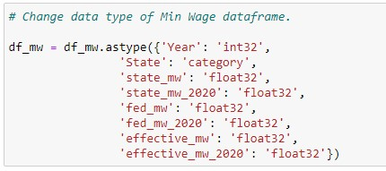
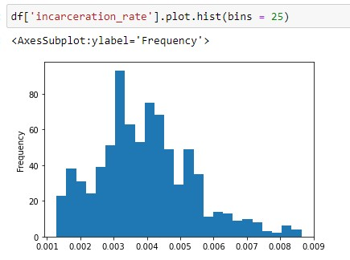
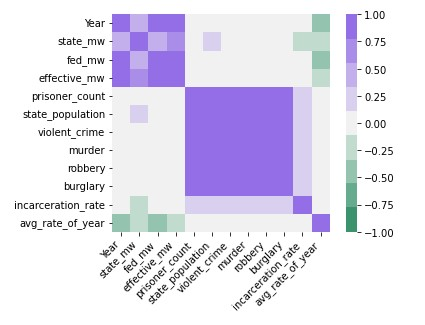
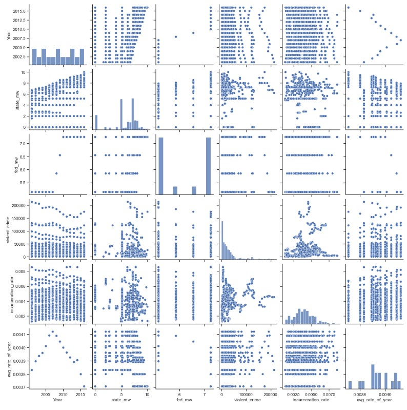
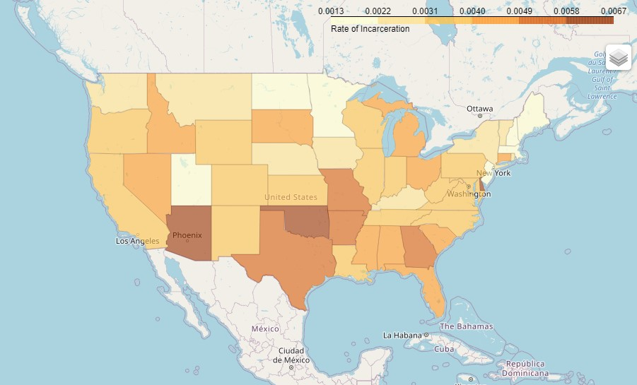
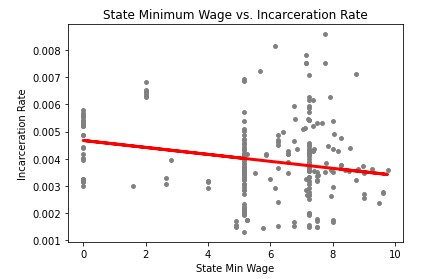
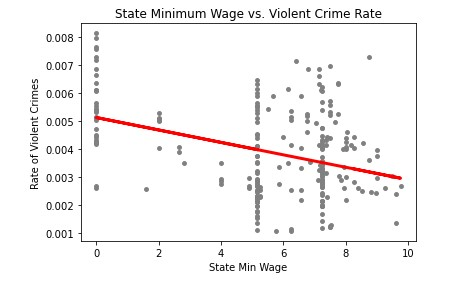
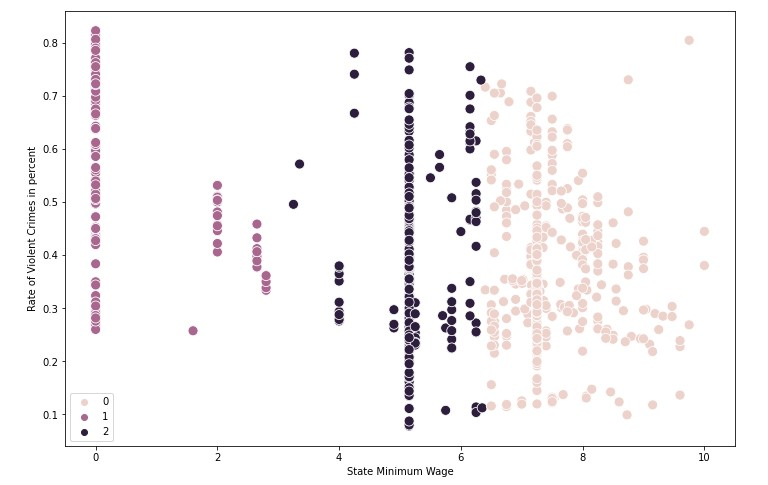
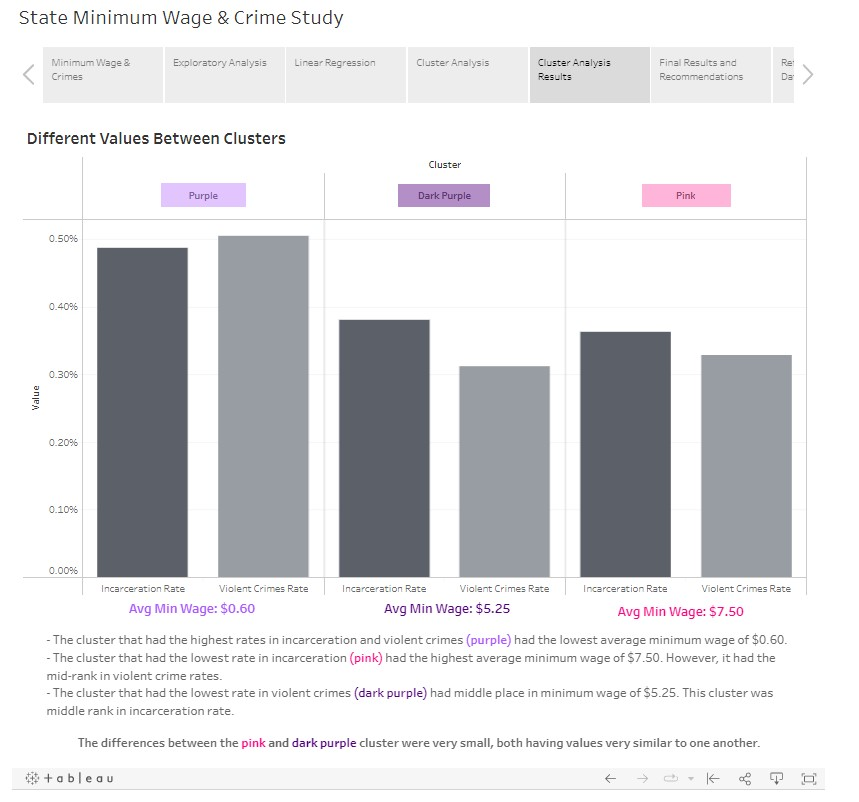

# Minimum Wage & Crime Study

  

### Background
Wealth inequality is often referred to as a contributor to increased crime rates, and some studies have even shown this assumption to be supported (see reference below). Such interpretations drove my curiosity for this personal project which looks into the direct connection between state minimum wage and state crime rate. The primary goal of this study was to uncover if state minimum wage had any direct impact on the incarceration rate and violent crime rate. Linear relationship was tested by way of performing linear regression and data grouping was tested by way of performing k-means clustering. 

### Tools & Context
- **Python:** the bulk of this analysis was performed on this programming language, including geospatial analysis, linear regression, k-means clustering, Dickey-Fuller testing, autocorrelation, plotting, and differencing non-stationary time-series data. Libraries used: pandas, numpy, scipy, matplotlib, seaborn, sklearn, folium.
- **Tableau:** final presentation dashboard was created using this software for data visualization. 
- **Jupyter Notebook:** this web-based interactive computing platform was used for streamlined documentation of all Python scripts. 

### Data Source
This analysis was conducted by merging two separate open-source data found on Kaggle. 
- Historical minimum wage per year for each state from 1968 to 2020, found [here](https://www.kaggle.com/datasets/lislejoem/us-minimum-wage-by-state-from-1968-to-2017?resource=download). This dataset was compiled by the Kaggle contributor with public information found on the U.S. Department of Labor website.
- Crimes and incarceration by state from 2001 to 2016, found [here](https://www.kaggle.com/datasets/christophercorrea/prisoners-and-crime-in-united-states?select=ucr_by_state.csv). This dataset was complied by the Kaggle contributor using data provided by the Bureau of Justice Statistics. 

### Methodology
1. The two datasets were found and downloaded from Kaggle. Then, they were cleaned and wrangled in Python before the two were merged into one large dataframe. 

    

      
    

    

      <em>Python code to find missing values.</em>
    

    
    

      
    

    

      <em>Python code used to change the data type to decrease the memory usage from 179.0 KB to 83.7 KB. </em>
    

    
    

      
    

    

      <em>Python code used to create a subset of the Min Wage dataset only including years 2001 to 2016.</em>
    

    
    

      
    

    

      <em>Once both datasets were cleaned and wrangled, the two were merged into one dataframe.</em>
    

2.	After merging the datasets into one main dataframe, new variables were derived and exploratory analysis was performed to locate interesting relationships present in the data. 

    

      
    

    

      <em>Histogram showing the distribution of the newly derived variable ‘incarceration_rate’.</em>
    

    
    

      
    

    

    

      
    

    

      <em>A correlation heatmap (top) and pair plots (bottom) were created using Seaborn library functions to investigate relationships between variables.</em>
    

3.	In addition to exploring variable relationships, geospatial analysis was conducted by drafting a choropleth map to see how incarceration rates differed between states. The map was constructed using a Folium library function. 
    

      
    

    

      <em>Majority of states with higher incarceration rates were concentrated in the South and the South-West.</em>
    
 

4.	To test the existence of linear relationships between variables, two hypotheses were formulated, and linear regression analysis was performed to test both hypotheses. The linear regression tests were run by using a Scikit-learn library function. 
    

      
    

    

      <em>Hypothesis 1: As state min-wage increases, state incarceration rates decreases.</em>
    
 
    
    

      
    

    

      <em>Hypothesis 2: As state min-wage increases, state violent crime rates decreases.</em>
    
 

5.	Both regressions showed to have negative relationships, however, the statistical significance was far too low to reject the null hypotheses. Since the linear regression testing was not sufficient enough to explain the data, a k-means cluster analysis was conducted to uncover if any other patterns existed within the data. 

    

      
    

    

      <em>The k-means clustering was performed using a Scikit-learn library function.</em>
    
 

6.	A final dashboard was created in Tableau, presenting all the key findings in an interconnected format.
   
     

### Key Findings
- Although wealth inequality may contribute to crimes rates, the linear regression testing conducted in this study found that the direct relationship between state minimum and incarceration rate, along with the relationship between state minimum wage and violent crime rate, were close to non-existent.
-	However, the cluster analysis did show that states with excessively low minimum wage ($0.60 per hour) were more likely to be associated with higher incarceration rate and violent crime rate. 

#### Next Step
This study did not take into account cost of living in each state. In the next study, I would like to investigate how the state minimum wage, within the context of cost of living, impacts violent crime rates and incarceration rates. 

### Deliverables
### [Final Tableau Dashboard](https://public.tableau.com/views/MinimumWageIncarcerationStudy/FinalStory?:language=en-US&publish=yes&:display_count=n&:origin=viz_share_link)

  

#### References
*Anser, M.K., Yousaf, Z., Nassani, A.A. et al. Dynamic linkages between poverty, inequality, crime, and social expenditures in a panel of 16 countries: two-step GMM estimates. Economic Structures 9, 43 (2020). https://doi.org/10.1186/s40008-020-00220-6
